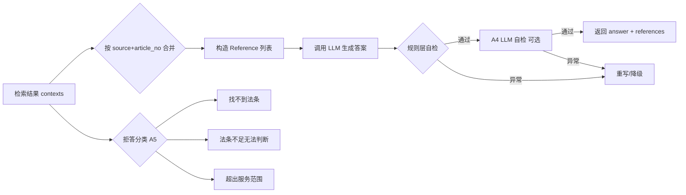

## User Requirements
继续实现法律助手回答内容侧优化项 A1、A2、A4、A5、A9。

## Product Overview
在已有 RAG 法条问答系统基础上，对答案生成与引用展示环节进行质量优化，提升引用可读性、可追溯性、真实性与拒答准确性。

## Core Features
- **A1 引用去重与合并展示**：同一法规同条号下的多款原文合并为一条引用，避免前端重复列出同一法条。
- **A2 引用与事实对应标注**：在答案的“依据”部分，要求模型在每条引用后说明其对应用户事实，增强可追溯性。
- **A4 反向约束/幻觉自检**：在生成答案后增加后处理步骤，检查答案是否编造法条、是否超范围推论，并对异常结果进行降级或告警。
- **A5 拒答场景细分**：将当前统一的“无相关法条”拒答细分为“找不到法条”“法条不足无法判断”“超出服务范围”三类，分别给出更精确的回复。
- **A9 法规引用格式统一**：强制引用使用《法规全称》+ 条号格式，避免简称/不规范引用混用。


## Tech Stack Selection
- **Backend**: Python + FastAPI（现有）
- **LLM**: 阿里云百炼 OpenAI 兼容接口（`app/llm.py`）
- **Prompt management**: 版本化 `prompts/` 模板 + `app/prompt_loader.py`
- **Config/Policy**: `app/config.py` + `config/policy.json`
- **Frontend**: React + TypeScript（现有）
- **Testing**: pytest（现有）

## Implementation Approach
以 `app/qa.py` 的答案后处理为入口，围绕“引用构造 → 提示词约束 → 生成后自检 → 拒答分类”四个环节做最小侵入式改造：

1. **引用合并与格式统一（A1/A9）**：在 `qa.py` 中将 `contexts` 按 `(source, article_no)` 分组，同一法条多款按顺序拼接为单条 `Reference.text`（保留“第X款”标识），并在构造阶段校验/补全书名号与条号格式。系统提示同步强化“同条多款合并引用、使用《全称》+ 条号”的要求。
2. **事实对应标注（A2）**：通过更新 `prompts/legal_system.txt` 的“依据”输出规范，要求模型在每条引用后追加“对应用户事实：……”说明。
3. **拒答细分（A5）**：新增 `_classify_refusal(resolved, contexts, intents)` 函数，根据检索结果、意图和命中条款角色区分三类拒答场景，分别渲染不同 prompt 模板，避免统一拒答。
4. **幻觉自检（A4）**：新增 `_self_check_answer(answer, contexts, question)` 函数。先以规则层快速扫描答案中的法条引用是否全部落在检索上下文中；再通过配置启用的 LLM 后处理检查超范围推论与编造内容。发现问题时重写答案并追加风险提示，未通过则降级为拒答。
5. **配置开关**：在 `Settings` 中新增 `answer_self_check_enabled` 等开关，控制 A4 是否启用 LLM 后处理，降低延迟和 token 成本。

## Implementation Notes
- **Grounded**: 复用现有 `Reference` 模型与 `prompts/` 版本化管理机制，不引入新的抽象层。
- **Performance**: A4 的 LLM 后处理默认关闭（或仅在非流式路径启用），流式路径优先使用规则层自检，避免二次 LLM 调用阻塞前端。
- **Blast radius**: A1 合并逻辑需同时覆盖 `answer()` 和 `answer_stream()` 两个入口；新增 schema 字段均为可选，保持前后端兼容。
- **Logging**: 使用现有 `event()` 记录合并数、拒答类型、自检告警等可观测事件。
- **Backward compatibility**: `off_topic.txt` 继续作为兜底模板；A5 新增模板缺失时回退到原模板。

## Architecture Design


## Directory Structure
```
c:/Users/19674/PycharmProjects/law_helper/
├── app/
│   ├── qa.py                          # [MODIFY] 新增引用合并、拒答分类、自检函数；同步修改 answer/answer_stream
│   ├── schemas.py                     # [MODIFY] Reference 可选扩展字段（如 merged_from / paragraphs）
│   ├── config.py                      # [MODIFY] 新增 answer_self_check_enabled 等配置
│   └── policy.py                      # [NO CHANGE] 复用现有策略加载
├── prompts/
│   ├── legal_system.txt               # [MODIFY] 强化 A1/A2/A9 输出规范，明确引用格式与事实对应要求
│   ├── off_topic.txt                  # [NO CHANGE] 保留为兜底模板
│   ├── refusal_no_law.txt             # [NEW] “找不到法条”拒答模板
│   ├── refusal_insufficient.txt       # [NEW] “法条不足无法判断”拒答模板
│   └── refusal_out_of_scope.txt       # [NEW] “超出服务范围”拒答模板
├── config/
│   └── policy.json                    # [MODIFY] 增加拒答分类与提示参数
├── frontend/src/
│   ├── components/References.tsx      # [MODIFY] 如新增 paragraphs 字段则分段展示
│   └── types.ts                       # [MODIFY] 同步 Reference 类型
└── tests/
    ├── test_prompts.py                # [MODIFY] 验证新增 prompt 模板渲染
    └── test_qa.py 或现有测试文件      # [MODIFY/NEW] 引用合并、拒答分类、自检规则断言
```

## Key Code Structures
```python
# app/schemas.py 扩展示例
class Reference(_BaseSchema):
    source: str = Field("", description="法条来源文档全称")
    article_no: str = Field(..., min_length=1, description="条号，如“第九十一条”")
    section_header: str = Field("", description="所属章/节标题")
    text: str = Field(..., min_length=1, description="法条原文；多款合并后保留款标识")
    merged_from: list[str] = Field(default_factory=list, description="合并来源的 chunk id 列表")
```

```python
# app/qa.py 关键函数签名
def _merge_references(contexts: list[dict]) -> list[Reference]: ...
def _classify_refusal(question: str, contexts: list[dict], intents: list[str]) -> Literal["no_law", "insufficient", "out_of_scope"] | None: ...
def _self_check_answer(question: str, answer: str, contexts: list[dict]) -> tuple[bool, str | None]: ...
```


## Agent Extensions
- **[subagent:code-explorer]**
  - Purpose: 在正式修改前对引用链、拒答分支和前端展示做跨文件影响分析，确认所有 Reference 消费点与拒答入口。
  - Expected outcome: 输出受影响文件清单、调用关系与改造建议，避免遗漏 `answer()` / `answer_stream()` 双路径及前端 `References.tsx` 类型同步。
