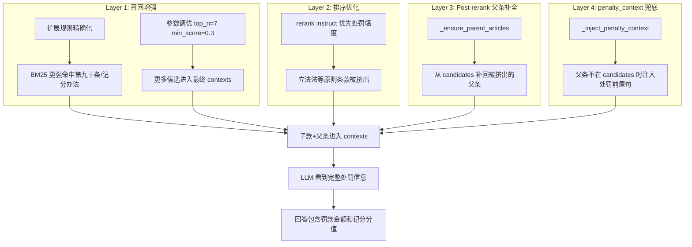

## 问题概述

用户提问"闯红灯怎么判"时，系统回答存在以下缺陷：
1. **道交法第九十条（罚款金额"处警告或者二十元以上二百元以下罚款"）完全未召回**——用户无法得知具体罚款金额
2. **记分办法第十条父条（含"一次记6分"）未进入 top_n**——只有子款（第八款，正文仅"驾驶机动车不按交通信号灯指示通行的；"）被召回，LLM 回答中写"未显示具体记分分值"
3. **立法法第十一条（限制人身自由的处罚只能由法律规定）不相关却占了 top_n 位置**——挤占了本应属于第九十条/记分办法父条的 slots
4. **penalty_context 已写入 ChromaDB 但未展示给 LLM**——`_build_user_prompt` 只展示 `c['text']`，子款的 `penalty_context`（含"一次记6分"）虽在检索/重排阶段生效，LLM 却看不到

## 核心功能

- **Post-rerank 父条补全**：子款进入 top_n 但父条被挤出时，从 candidates 中补回父条，保证 LLM 看到完整法条
- **penalty_context 注入 LLM 可见层**：父条确实不在 candidates 时，将 penalty_context 作为前缀拼入子款 text，兜底展示处罚信息
- **增强"闯红灯"扩展规则**：从泛化表述改为精确法条术语，分别命中记分条款与罚则条款（不硬编码法条编号）
- **优化 rerank 排序**：instruct 引导优先保留具体处罚幅度条款，避免法律原则条款占位
- **参数调优**：增加 top_n、降低 min_score 和 BM25 阈值，提升召回覆盖率


## Tech Stack
- Python 3.12 + FastAPI（现有项目）
- ChromaDB（向量库）+ BM25（关键词检索）+ qwen3-vl-rerank（重排序）
- 无新增技术栈，所有改动基于现有架构

## 根因分析

问题出在 **5 个环节的叠加效应**：

### 环节1：penalty_context 未注入最终 Prompt
`app/qa.py::_build_user_prompt`（第420-480行）只展示 `c['text']`，不展示 metadata 中的 `penalty_context`。子款被召回后，LLM 看到的 text 只有行为描述"驾驶机动车不按交通信号灯指示通行的；"，看不到"一次记6分"。

### 环节2：父条被 rerank 挤出 top_n
`app/retrieval.py::_expand_article_hierarchy`（第406-478行）在子款命中时把父条加入 candidates，但父条因长正文（包含所有 11 款）被 rerank 模型打了低分，被 `RERANK_TOP_N=5`（.env 配置）挤出。

### 环节3：扩展规则太泛
`config/policy.json` 第10行：`"违反交通信号灯 不按信号灯指示通行 处罚"`——没有明确包含"一次记6分""罚款金额"等词，BM25 对道交法第九十条和记分办法第十条父条的召回不够强。

### 环节4：不相关条款占位
立法法第十一条通过全局路召回后，rerank 模型因 instruct 提到"处罚种类定义条款"给了它分数，挤占了 top_n 中本应属于具体处罚条款的位置。

### 环节5：参数限制
- `RERANK_TOP_N=5`（.env）：5 条不够覆盖行为定性+罚则+记分+处罚对象+程序
- `RERANK_MIN_SCORE=0.4`（.env）：可能过滤相关但分数稍低的条款
- `EXPANSION_ENSURE_MIN_BM25=20.0`（config.py 默认）：扩展查询保底阈值偏高
- `EXPANSION_ENSURE_QUOTA=3`（config.py 默认）：保底数量偏少

## Implementation Approach

### 策略：4 层修复，逐层兜底



### 关键设计决策

1. **先补父条，再注入 penalty_context**：`_ensure_parent_articles` 先从 candidates 补回父条；`_inject_penalty_context` 仅对仍缺父条的子款注入处罚上下文。两者不重复，无副作用。

2. **修改 text 而非 metadata**：`_inject_penalty_context` 直接修改 `c["text"]`，这样 `_build_user_prompt` 和 `_merge_references` 都自然看到注入后的内容，无需额外修改这两个函数。

3. **不硬编码法条编号**：扩展规则使用法条术语（如"一次记6分""处警告或者二十元以上二百元以下罚款"），不引用"第九十条"等编号。与现有 expansion_rules 风格一致。

4. **参数调优分层**：`.env` 调用户可覆盖的运行时参数（top_n, min_score）；`config.py` 调默认值（expansion_ensure_quota, min_bm25）；`policy.json` 调策略参数（top_per_query, instruct）。

## Implementation Notes

- **性能**：`_ensure_parent_articles` 遍历 candidates 一次（O(n)），n 通常 ≤ 24（rerank_candidate_limit），无性能瓶颈。`_inject_penalty_context` 遍历 contexts 一次（O(k)），k ≤ 7（top_n+补全），可忽略。
- **Blast radius**：新增两个 post-processing 函数，仅在 `_ensure_expansion_hits` 之后插入两行调用。不修改 rerank/retrieval/ingestion 逻辑，不影响已有场景。
- **向后兼容**：父条补全和 penalty_context 注入都是"追加"操作，不删除任何已有 contexts。如果 candidates 中没有父条，`_inject_penalty_context` 兜底；如果连 penalty_context 也为空，子款 text 不变，降级为原有行为。
- **幂等性**：`_inject_penalty_context` 检查父条是否已在 contexts 中，避免重复注入。`_ensure_parent_articles` 检查 id 去重，避免重复追加。

## Architecture Design

### 数据流（修改后）

```
retrieval.multi_query_search → candidates (含子款+父条)
    ↓
rerank.rerank → contexts (top_n=7, min_score=0.3)
    ↓
apply_role_adjustment → contexts (角色排序)
    ↓
_ensure_expansion_hits → contexts (扩展保底)
    ↓
_ensure_parent_articles [NEW] → contexts (补回被挤出的父条)
    ↓
_inject_penalty_context [NEW] → contexts (兜底注入处罚上下文)
    ↓
_build_user_prompt → LLM prompt (含完整处罚信息)
    ↓
_merge_references → references (父条+子款合并展示)
```

### 插入点

**answer()**（第577行之后）：
```python
contexts = _ensure_expansion_hits(expansions, candidates, contexts, engine)
contexts = _ensure_parent_articles(candidates, contexts)    # NEW
contexts = _inject_penalty_context(contexts)                 # NEW
```

**answer_stream()**（第760行之后）：
```python
contexts = _ensure_expansion_hits(expansions, candidates, contexts, engine)
contexts = _ensure_parent_articles(candidates, contexts)    # NEW
contexts = _inject_penalty_context(contexts)                 # NEW
```

## Directory Structure

```
project-root/
├── app/
│   ├── qa.py              # [MODIFY] 新增 _ensure_parent_articles + _inject_penalty_context 函数；
│   │                      #        在 answer() 和 answer_stream() 的 _ensure_expansion_hits 之后插入调用
│   └── config.py          # [MODIFY] expansion_ensure_quota 3→5, expansion_ensure_min_bm25 20.0→10.0
├── config/
│   └── policy.json        # [MODIFY] 闯红灯扩展规则精确化(1条→2条); rerank.instruct 追加处罚幅度优先指引;
│                          #        expansion_ensure_top_per_query 2→3
├── .env                   # [MODIFY] RERANK_TOP_N 5→7, RERANK_MIN_SCORE 0.4→0.3
└── tests/
    └── test_retrieval_quality.py  # [MODIFY] 新增3个测试: 父条补全/penalty_context注入/父条在时跳过注入
```

## Key Code Structures

### `_ensure_parent_articles` 函数签名

```python
def _ensure_parent_articles(candidates: list[dict], contexts: list[dict]) -> list[dict]:
    """子款在 contexts 中但父条不在时，从 candidates 补回父条。

    解决父条因长正文被 rerank 低分挤出 top_n，导致 LLM 看不到
    完整法条（含处罚前置句"一次记6分"等）的问题。
    补回后 _merge_references 会将父条与子款合并为单条引用。
    """
```

### `_inject_penalty_context` 函数签名

```python
def _inject_penalty_context(contexts: list[dict]) -> list[dict]:
    """对仍缺父条的子款，把 penalty_context 作为前缀拼入 text。

    兜底机制：当 _ensure_parent_articles 也找不到父条时（父条
    未进入 candidates），通过注入处罚前置句让 LLM 至少看到
    "一次记6分""处...拘留"等关键处罚信息。
    直接修改 c["text"]，_build_user_prompt 和 _merge_references
    自然看到注入后的内容。
    """
```

