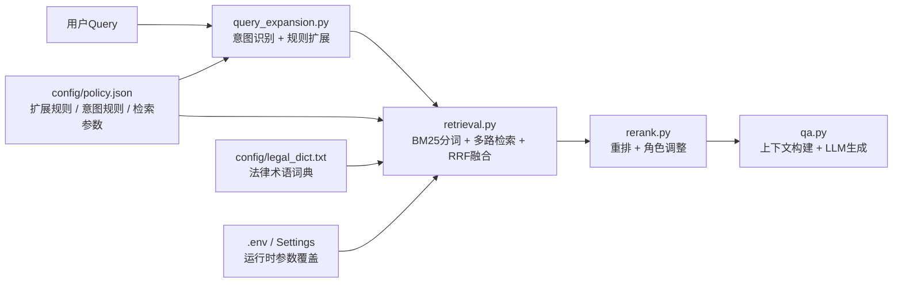

## 用户选择
R1、R2、R3、R7

## 需求概述
在现有法律问答助手（law_helper）召回链路基础上，以配置驱动方式做四层优化，提升法条召回的准确性与可调试性，不改动前端与生成模型。

## 核心优化点
- **R1 法律领域 BM25 分词增强**：当前 `retrieval.py` 使用通用 jieba 分词，对"行政拘留""记分""强制措施""非机动车"等法律/交通专业术语可能切分过细。新增 `config/legal_dict.txt` 用户词典，让 BM25 在词项层面更贴合法条表达。
- **R2 查询意图细分（否定/例外/情形）**：当前 `policy.json` 的意图规则主要覆盖定义/处罚/责任/程序/赔偿/效力等正向意图。新增否定（"未佩戴头盔"）、例外（"不用等红灯"）、情形（"轻微事故"）等意图标签，用于调整扩展查询策略与后续排序。
- **R3 查询扩展规则补全**：当前 `policy.json` 中 `expansion_rules` 仅 7 条。补充超速、违停、无证驾驶、不礼让行人、事故认定、未戴头盔、占用应急车道、逆行等常见交通/治安场景，遵循"单条扩展精确命中一个法律关系"原则。
- **R7 多路检索参数可调/可实验**：当前 `retrieval.py` 仍存在 route_floor、cap、concept boost、protected boost、引用正则等硬编码值。将这些参数下沉到 `policy.json` / `Settings`，支持不重启或快速调参，并保持向后兼容。


## 技术栈
保持现有后端栈不变：
- FastAPI + Pydantic Settings
- ChromaDB + BGE-base-zh-v1.5 / 阿里云百炼 Embedding
- jieba + BM25Okapi
- 阿里云百炼 qwen3.7-text-rerank + qwen-plus
- policy.json 数据驱动配置

## 实现策略
1. **配置优先**：新增/调整的规则与参数优先进入 `config/policy.json`，部分运行时数值提供 `Settings` 覆盖，未配置时完全回退到当前行为。
2. **向后兼容**：不修改函数对外签名，不破坏现有 `retrieval.py` / `rerank.py` / `qa.py` 调用链。
3. **局部改动**：只修改 `retrieval.py`、`query_expansion.py`、`qa.py`、`config.py`、`config/policy.json`，并新增 `config/legal_dict.txt`。
4. **可观测**：新增/复用 `event` 埋点，记录分词加载、意图命中、参数覆盖、扩展规则命中等情况。

## 架构设计
保持现有召回链路，在入口层增加配置驱动。



## 目录结构
```
c:\Users\19674\PycharmProjects\law_helper\
├── config/
│   ├── policy.json              # [MODIFY] 新增意图规则、扩展规则、检索参数
│   └── legal_dict.txt           # [NEW] 法律/交通领域用户词典，供 jieba 加载
├── app/
│   ├── config.py                # [MODIFY] 新增可选 Settings 字段覆盖 policy 参数
│   ├── retrieval.py             # [MODIFY] 加载用户词典；参数化硬编码值
│   ├── query_expansion.py       # [MODIFY] 增加否定/例外/情形意图识别
│   └── qa.py                    # [MODIFY] 根据新意图微调检索查询组合
└── tests/
    ├── test_retrieval_quality.py # [MODIFY] 增加分词与参数测试
    └── test_query_expansion.py   # [NEW] 意图识别与扩展规则测试
```

## 关键实现细节
- **R1**：在 `retrieval.py` 模块级或 `_tokenize` 中调用 `jieba.load_userdict(str(path))`，文件不存在时降级为无词典；词典条目格式为"词语 词频 词性"或仅"词语"。
- **R2**：在 `policy.json` 的 `query.intent_rules` 中新增 `negation` / `exception` / `scenario` 等规则；`classify_query_intents` 返回这些标签；`qa.py` 中据此决定是否追加"正面要件"扩展以抵消否定词的召回偏差。
- **R3**：新增的 `expansion_rules` 仍保持 `{triggers, requires, enhancement}` 结构，`enhancement` 聚焦一个具体法律关系（如"机动车行驶超过规定时速"），避免长正文稀释。
- **R7**：将 `route_floor`、`candidate cap`、`concept boost`、`protected boost`、引用正则模式等抽取为 `policy.json` 中 `retrieval.advanced` / `retrieval.reference_patterns`；`config.py` 新增对应 `Settings` 字段并支持 `.env` 覆盖，运行时按 `Settings → policy.json → 硬编码默认值` 优先级读取。


## Agent Extensions

- **[subagent:code-explorer]**
  - Purpose: 在计划执行前全面扫描 `retrieval.py`、`query_expansion.py`、`qa.py` 中尚未参数化的硬编码值、魔法数字、正则模式及调用点，确保 R7 不遗漏。
  - Expected outcome: 输出一份"硬编码参数清单"（含文件路径、行号、当前值、建议配置键名），作为 R7 修改依据。

- **[skill:lsp-code-analysis]**
  - Purpose: 分析检索链路中各函数的类型依赖与引用关系，验证新增配置项不会影响 `rerank.py`、`main.py`、`jobs.py` 等下游模块。
  - Expected outcome: 确认 `retrieval.py` / `query_expansion.py` / `qa.py` 的函数签名与返回值类型无需变更，保障向后兼容。
