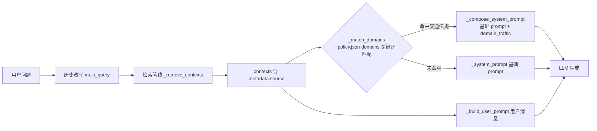

## 用户需求
对 `prompts/legal_system.txt` 中已过拟合到「摩托车上高速被拘留」单一案例的提示词规则进行去硬编码改造。此前多轮迭代中，针对该案例「打补丁」式加入的具体规则（如「不得载人」「无证驾驶、冲卡」「《立法法》第十一条」「禁令标志」等）已使通用法律问答提示词退化为单一场景专用提示词，且部分规则相互矛盾（如「法无禁止即可为」与「不能从不得载人反推允许上高速」）。

## 产品 Overview
将提示词拆分为「通用层 + 领域层」两层结构：通用层只保留适用于全部法律领域的推理原则与回答格式；交通领域特有规则（禁令标志合法性审查等）拆分到独立领域模块，仅当检索命中的法条属于交通类法规时才动态附加到本次回答的指令中，其他领域问题不受干扰。

## Core Features
- **通用提示词去案例化**：清除全部单一案例词汇（不得载人、允许上高速、无证驾驶、冲卡、拘留专项条款、立法法第十一条等），抽象为通用表述；同时保留既有产品要求——分析/结论/建议三段式结构、法条编号列表逐项列举、维度分段、「法无禁止即可为」与「法无授权即禁止」最后通牒（结论两句缺一不可）、上位法溯源审查
- **新增否定性结论表述规范**：「法律未禁止」类否定性判断只能表述为「本次检索到的条文范围内未发现……」，不得作绝对化断言（解决「上位法未明确禁止」无引用支撑的问题）
- **领域规则独立成模块**：禁令标志/禁止标线合法性审查等交通特有规则移入独立领域提示词文件，保持领域内通用（不绑定摩托车单一场景）
- **按检索结果动态注入**：检索命中的法条来源属于交通类法规时，领域规则自动附加到本次回答指令中；拒答路径行为完全不变
- **测试同步更新并建立守护**：改写依赖具体文案的断言，新增「去硬编码守护测试」防止案例词回流，新增领域注入逻辑测试


## Tech Stack Selection
完全复用现有项目技术栈与模式，不引入新依赖：
- 提示词加载：`app/prompt_loader.py` 的 `render_prompt(name, **values)`（lru_cache 缓存、缺变量抛 ValueError、`clear_prompt_cache()` 供测试）
- 策略配置：`config/policy.json` + `app/policy.py` 的 `get_policy()`（项目既有「数据驱动策略外置」模式，domains 配置节与 query/retrieval/rerank 节并列）
- 注入逻辑：`app/qa.py`（问答编排层），在主生成路径拼装 system prompt

## Implementation Approach

### 总体策略
**两层提示词 + 检索后动态拼接**。基础 system prompt（legal_system.txt 渲染）保持静态缓存不变；检索管线 `_retrieve_contexts()` 返回 contexts 后，基于各候选 `metadata.source` 与 policy.json 中领域关键词做子串匹配，命中的领域段（domain_traffic.txt）追加拼接为本次请求的 system prompt。拒答分支（trivial / no_contexts / conversation_meta）不注入领域规则，行为零变化。

### 关键决策与理由
1. **领域映射放 policy.json 而非代码常量**：与项目现有 retrieval/query 策略同源，版本化外置、无需改代码即可扩展新领域（如未来加劳动、婚姻域），符合 policy.py「Data-driven retrieval policy」定位。
2. **子串匹配而非精确法规名列表**：`law_sources` 由 statute/ 文件名经 `_clean_source_name` 动态生成（含日期后缀清洗），如「中华人民共和国道路交通安全法_20210429.docx」→「中华人民共和国道路交通安全法」。用关键词子串（如「道路交通安全法」）匹配最稳健，且天然覆盖实施条例（名称包含「道路交通安全法实施条例」）。
3. **只改主生成路径（answer L735、answer_stream L865）**：拒答分支不需要领域规则，控制 blast radius；`_system_prompt()` 的 `lru_cache(maxsize=1)` 保持不动，动态拼接放在新增函数中按命中域名缓存。
4. **测试断言「保留通用措辞」**：重写 legal_system.txt 时尽量保留现有测试断言的通用文案（「结论只写 2-3 句话」「跨法规关联」等），仅改写依赖案例词的断言，最小化测试改动。

### legal_system.txt 泛化映射表（重写执行清单）

| 位置 | 现状（硬编码） | 泛化为 |
|---|---|---|
| L9 末尾 | 「拘留、行政拘留…《立法法》第十一条…不会被拘留」 | 「用户未提及某一处罚或强制措施情形时，不得把该处罚是否有法律依据作为分析维度，也不得引用仅用于说明处罚设定权限的条款来论证不会被处罚」 |
| L12/14 | 「如‘被拘留’」举例 | 「用户陈述的某一结果（如某项处罚或强制措施）」 |
| L20 | 引用格式举例《道路交通安全法》第九十一条 | 《中华人民共和国民法典》第一百四十三条（与本案无关的通用示例） |
| L26 后半 | 「禁令标志」 | 「地方性法规、地方政府规章等下位规范若要构成有效禁止，必须具备上位法授权且依法制定，不能默认其合法有效」 |
| L27 | 上位法溯源（含道交法例子、禁令标志） | 原则泛化保留：处罚依赖下位规范时必须先审查上位法授权与制定权限；「禁令标志」细节整体移入 domain_traffic |
| L28 | 整条「禁止默认禁令标志合法有效」 | 整条移入 domain_traffic.txt |
| L29 | 「行政拘留、罚款、扣车」 | 「限制人身自由或财产权利的处罚、强制措施」 |
| L31 | 「不能从‘不得载人’推出‘允许上高速’」 | 「不能从‘某条仅规定特定限制’反推该条或整部法规许可了其他行为」（去具体例子） |
| L32 | 「无证驾驶、冲卡…《立法法》第十一条」 | 「不推定用户未提及的其他违法事实或情节；用户未提及某一处罚结果时，不得主动引入该处罚结论，也不得引用仅用于说明处罚设定权限的条款」 |
| L35 | 「拘留原因」 | 「该结果的原因」 |
| 新增 | — | 否定性结论表述规范：「本次检索到的条文范围内未发现……」，不得断言「上位法未禁止」「法律未禁止」 |

**必须保留项**：三段式结构与标题格式约束、维度分段、法条 1.2.3. 编号列表、法条间关系说明、最后通牒（结论两句缺一不可、法无禁止即可为限定检索范围表述）、引用规范 A9/A2、内部思考六步、表达要求。

### domain_traffic.txt 内容要点（新建）
- 禁令标志、禁止标线若要构成有效禁止，须由有权机关依据上位法授权依法设置，不能默认合法有效
- 以「违反禁令标志」为由适用处罚条款须同时满足：上位法授权可设禁令、标志依法设置、行为人确实违反
- 检索文本无法确认禁令标志合法来源时，明确指出处罚前提存在重大缺口，不能认定违反禁令标志，不得作「若违反则记分/罚款」的假设性处罚判断
- 文件不含 `{var}` 占位符，直接 `render_prompt("domain_traffic")` 渲染

## Implementation Notes
- **性能**：`_match_domains` 为 O(contexts × domains) 集合求交（contexts ≤ rerank_top_n=7，可忽略）；领域段渲染按域名 `lru_cache` 缓存；拼接为一次字符串连接，无额外 LLM 调用、无检索延迟变化
- **可观测性**：注入时发 `event("prompt.domain_injected", domains=[...])`，沿用 qa.py 现有 event 埋点模式，便于线上验证注入命中率
- **回归控制**：answer/answer_stream 的拒答分支（trivial_reject、no_contexts、conversation_meta）一律不接入注入逻辑，保持现有行为；重写 legal_system.txt 时先核对 `test_legal_prompt_defaults_to_concise_visible_answer` 的全部断言文案再动笔
- **缓存注意**：`_read_prompt` 有 lru_cache，开发期改模板后需 `clear_prompt_cache()`（测试已有该模式）；`get_policy` 同理有 `clear_policy_cache()`

## Architecture Design

基础层静态缓存（`_system_prompt`，lru_cache 不变）；领域层按次动态拼接，是基础层的纯增量，不影响拒答路径。

## Directory Structure
```
law_helper/
├── prompts/
│   ├── legal_system.txt      # [MODIFY] 泛化重写：按映射表清除全部案例硬编码，新增否定性结论表述规范；保留最后通牒/编号列表/维度分段/上位法溯源等通用原则与全部格式约束
│   └── domain_traffic.txt    # [NEW] 交通领域专属规则：禁令标志与禁止标线的合法性审查三要件、不得默认有效、无法确认来源时的缺口提示；无占位符，纯静态文本
├── config/
│   └── policy.json           # [MODIFY] 顶层新增 "domains" 配置节：traffic 域的 prompt 模板名与法规关键词列表（道路交通安全法/机动车驾驶证/道路交通安全违法行为记分等子串）
├── app/
│   └── qa.py                 # [MODIFY] 新增 _match_domains(contexts) 与 _compose_system_prompt(contexts)（含域名级 lru_cache 与 event 埋点）；answer() 主生成（约 L735）与 answer_stream() 主生成（约 L865）两处调用点替换为动态拼装；拒答分支不动
└── tests/
    └── test_prompts.py       # [MODIFY] test_all_prompt_files_are_present 增加 domain_traffic；test_legal_prompt_blocks_unsupported_legal_inferences 断言改为泛化表述；新增去硬编码守护测试（案例词不得出现在 legal_system 渲染结果）、domain_traffic 渲染测试、_match_domains/_compose_system_prompt 注入单测（沿用现有 monkeypatch + SimpleNamespace 模式）
```

## Key Code Structures
```python
# app/qa.py 新增函数签名
def _match_domains(contexts: list[dict]) -> tuple[str, ...]:
    """依据 policy["domains"][*]["law_keywords"] 与 contexts 的 metadata.source
    做子串匹配，返回命中的领域名（如 ("traffic",)）。"""

def _compose_system_prompt(contexts: list[dict]) -> str:
    """基础法律 system prompt + 命中领域的领域段（lru_cache 按域名缓存渲染）；
    contexts 为空或未命中时返回基础 prompt，行为与原 _system_prompt() 完全一致。"""
```
```json
// config/policy.json 顶层新增节
"domains": {
  "traffic": {
    "prompt": "domain_traffic",
    "law_keywords": ["道路交通安全法", "机动车驾驶证", "道路交通安全违法行为记分"]
  }
}
```

